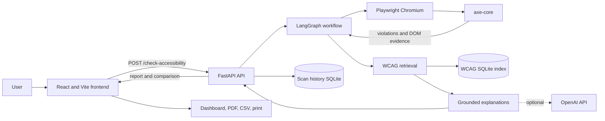

# Smart Web Accessibility Checker

Smart Web Accessibility Checker is a full-stack accessibility auditing application. Give it a public URL and it opens the rendered page in Chromium, runs `axe-core`, and turns detected violations into a readable report with WCAG references, affected elements, evidence, and recommended fixes.

The application stores scans locally so a team can scan the same page after making changes and see which rules were resolved, remain, or are newly detected. Reports can be downloaded as PDF or CSV, or printed from the browser.

## Features

- Scans rendered websites with Playwright and `axe-core 4.10.3`.
- Reports critical, serious, moderate, and minor violations with affected DOM nodes.
- Retrieves guidance from a checked-in WCAG 2.1/2.2 knowledge base.
- Produces evidence-backed explanations and practical remediation suggestions.
- Optionally uses OpenAI to select and summarize supporting evidence.
- Saves reports in SQLite and compares consecutive scans of the same URL.
- Finds images without alternative text and can suggest captions with BLIP.
- Exports results to PDF and CSV and supports print-friendly reports.

Automated scanning covers only rules that can be evaluated programmatically. A high score helps track improvements, but does not establish WCAG conformance. Keyboard use, screen-reader behavior, content quality, and incomplete axe checks still require manual review.

## Architecture



### How a scan works

1. React sends a URL and, when available, the previous scan ID to FastAPI.
2. FastAPI validates and normalizes the URL, then invokes the LangGraph workflow in a worker thread.
3. Playwright opens the page in headless Chromium at a fixed 1280 x 720 viewport. It waits for rendered content and lets dynamic DOM updates settle.
4. The backend injects the locally installed `axe-core` script and collects violations, incomplete checks, selectors, HTML snippets, failure summaries, and check data.
5. The retrieval layer maps axe tags to the checked-in WCAG corpus and ranks relevant passages from its SQLite TF-IDF index.
6. The explanation layer combines scanner evidence with WCAG guidance. If OpenAI is configured, it may select concise supporting excerpts; its output is validated against the supplied evidence.
7. The backend calculates the score, saves the report in SQLite, and compares it with the requested baseline scan.
8. React displays the score, severity counts, expandable explanations, WCAG sources, and before/after changes.

### Main components

| Path | Responsibility |
| --- | --- |
| `Frontend/src/App.jsx` | Calls the API and coordinates scan and caption requests |
| `Frontend/src/components/` | Scan form, dashboard, issue details, comparison, and exports |
| `Backend/backend.py` | FastAPI routes, validation, workflow, and persistence integration |
| `Backend/scanner.py` | Chromium lifecycle, axe execution, evidence, and score calculation |
| `Backend/rag.py` | WCAG chunking, TF-IDF vector indexing, filtering, and retrieval |
| `Backend/explain.py` | Grounded explanations, confidence, and optional OpenAI processing |
| `Backend/scan_history.py` | SQLite report storage and before/after comparison |
| `Backend/ingest_wcag.py` | Rebuilds the corpus from authoritative W3C documents |
| `Backend/image_checker.py` | Finds images without alternative text |
| `Backend/blip_captioner.py` | Generates optional image-caption suggestions with BLIP |

### Technology stack

| Layer | Technology |
| --- | --- |
| Frontend | React 19, Vite, Tailwind CSS |
| API | FastAPI, Pydantic |
| Scanning | Playwright, headless Chromium, axe-core 4.10.3 |
| Workflow | LangGraph |
| Retrieval and storage | Local TF-IDF vectors, SQLite |
| Optional AI | OpenAI through LangChain; BLIP for image captions |

## Reproduce the project locally

### Prerequisites

- Git
- Python 3.11 or newer
- Node.js 20.19+ or 22.12+
- Internet access for dependency installation and scanning public websites

These commands use PowerShell on Windows and start from the repository root.

### 1. Clone the repository

```powershell
git clone https://github.com/Mrunali01/Triwizardathon-Hackathon.git
cd Triwizardathon-Hackathon
```

### 2. Create the Python environment

```powershell
python -m venv venv
.\venv\Scripts\Activate.ps1
```

If PowerShell blocks activation, run `Set-ExecutionPolicy -Scope Process -ExecutionPolicy Bypass` in that terminal and activate again.

### 3. Install the backend and Chromium

```powershell
python -m pip install --upgrade pip
pip install -r Backend/requirements.txt
python -m playwright install chromium
```

### 4. Install the frontend

```powershell
cd Frontend
npm ci
cd ..
```

This also installs the pinned local `axe-core` script used by the Python scanner.

### 5. Configure OpenAI (optional)

Scanning, WCAG retrieval, deterministic explanations, comparison, and exports work without an API key. To enable OpenAI-supported summaries:

```powershell
Copy-Item Backend/.env.example Backend/.env
```

Edit `Backend/.env`:

```dotenv
OPENAI_API_KEY=your_openai_api_key
OPENAI_MODEL=gpt-4.1-mini
ENABLE_LLM=true
```

Leave the key empty or set `ENABLE_LLM=false` to use local deterministic explanations. Never commit `Backend/.env`; Git ignores it.

### 6. Start the backend

From the repository root with the virtual environment active:

```powershell
python -m uvicorn backend:api --app-dir Backend --host 127.0.0.1 --port 8000 --reload
```

The API is at `http://127.0.0.1:8000`; interactive API documentation is at `http://127.0.0.1:8000/docs`.

### 7. Start the frontend

Open a second terminal:

```powershell
cd Frontend
npm run dev
```

Open `http://localhost:5173`, enter a public URL such as `https://www.w3.org/WAI/`, and select **Start AI Scan**.

### 8. Reproduce before/after comparison

1. Scan a page. The scan ID is saved in browser local storage and the report in `Backend/data/scans.sqlite`.
2. Fix one or more reported problems on that page.
3. Scan the exact same URL again from the same browser.
4. Review the score change and the resolved, remaining, and new rule lists.

Comparison uses axe rule IDs. It shows whether a rule disappeared, remained, or appeared; it does not match individual DOM nodes across page versions.

## Configuration

| Variable | Default | Purpose |
| --- | --- | --- |
| `OPENAI_API_KEY` | Empty | Enables optional OpenAI summaries |
| `OPENAI_MODEL` | `gpt-4.1-mini` | Model used by the explanation layer |
| `ENABLE_LLM` | `true` | Set `false` for deterministic explanations only |
| `WCAG_DB_PATH` | `Backend/data/wcag.sqlite` | Generated WCAG vector index |
| `SCAN_DB_PATH` | `Backend/data/scans.sqlite` | Retained scan reports |
| `AXE_SCRIPT_PATH` | `Frontend/node_modules/axe-core/axe.min.js` | Script injected into scanned pages |
| `CORS_ORIGINS` | Local Vite origins | Frontend origins accepted by FastAPI |
| `VITE_API_BASE_URL` | `http://localhost:8000` | API URL used by React |

## API examples

Start a scan:

```powershell
$body = @{ url = "https://www.w3.org/WAI/" } | ConvertTo-Json
Invoke-RestMethod -Method Post -Uri http://127.0.0.1:8000/check-accessibility -ContentType "application/json" -Body $body
```

For comparison, add `previous_scan_id` to the request. Retrieve a saved report with `GET /scans/{scan_id}`.

| Method and route | Purpose |
| --- | --- |
| `POST /check-accessibility` | Scans a URL and optionally compares it with `previous_scan_id` |
| `GET /scans/{scan_id}` | Returns a retained scan report |
| `POST /generate-alt-text` | Finds uncaptioned images and requests BLIP suggestions |

## Scoring and WCAG evidence

The application deducts points for every affected element:

```text
score = max(0, 100 - 15 * critical_or_serious - 7 * moderate - 3 * minor)
```

The dashboard keeps axe's four impact counts and displays incomplete checks separately. The checked-in corpus contains WCAG 2.1 and 2.2 criteria plus selected HTML and ARIA techniques. Curated axe mappings and WCAG tags constrain retrieval before similarity ranking. OpenAI never creates a WCAG criterion or controls the score or confidence.

To refresh the corpus from W3C sources, run `python Backend/ingest_wcag.py`. This requires network access; the next scan rebuilds the local index when the corpus changes.

## Validation

```powershell
python -m unittest discover -s Backend/tests -v
cd Frontend
npm run build
npm run lint
cd ..
python Backend/tests/live_workflow.py
```

The live test starts temporary FastAPI, Vite, and fixture servers; runs real Chromium and axe; performs two scans; verifies comparison persistence; checks PDF/CSV downloads, caption fallback, and mobile overflow; then stops its servers. It disables OpenAI for repeatable results.

